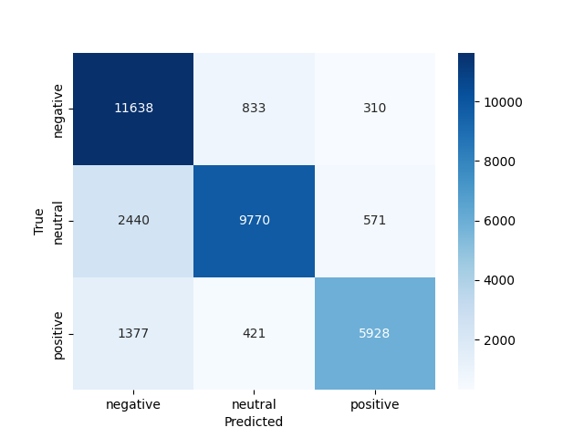

# Amazon 5-Star Review Classification Pipeline

This project performs **NLP-based multiclass classification** of Amazon reviews (1–5 stars) using a custom pipeline. The model achieves strong performance on this dataset.

---

## Dataset

**Source:** Daily Amazon User Feedback Dataset  
[OpenDataBay Link](https://www.opendatabay.com/data/dataset/3d2416ca-0ec4-44df-af49-db274b584529?utm_source=chatgpt.com)

| Attribute | Description |
|-----------|-------------|
| Records   | 75,000 lines |
| Size      | 21 MB CSV file |
| Columns   | reviewId, id, userName, content, score, thumbsUpCount, reviewCreatedVersion, at |

---

## Analysis

The pipeline includes **data cleaning, TF-IDF vectorization, oversampling of the neutral class, and Multinomial Naive Bayes classification**.  



**Note:** The main diagonal in the heatmap shows correctly predicted classes.

| Review Text                   | True Score | Predicted Score |
| ----------------------------- | ---------- | --------------- |
| "Great app, very useful!"     | 5          | Positive        |
| "Too many bugs."              | 1          | Negative        |
| "It's okay, nothing special." | 3          | Neutral         |


### Classification Report

| Class     | Precision | Recall | F1-score | Support |
|-----------|-----------|--------|----------|---------|
| Negative  | 0.7530    | 0.9106 | 0.8243   | 12,781  |
| Neutral   | 0.8862    | 0.7644 | 0.8208   | 12,781  |
| Positive  | 0.8706    | 0.7673 | 0.8157   | 7,726   |

**Overall Accuracy:** 0.8212  
**Macro F1-score:** 0.8203

---
## Features:

- Uses **NLP techniques** to classify Amazon reviews into 1-5 stars.  
- Handles **class imbalance** for neutral reviews to improve accuracy.  
- Includes a **clean, reusable pipeline** for text preprocessing, TF-IDF, and classification.  
- Outputs **confusion matrix and metrics** for easy evaluation.  
- Can be extended for **sentiment analysis, recommendation systems, or business insights**.

## Tech Stack

- **Python 3.13**  
- **Pandas** – data manipulation  
- **Scikit-learn** – train/test split, TF-IDF, Multinomial Naive Bayes, metrics  
- **Matplotlib & Seaborn** – visualization of confusion matrix  
- **Regex & String processing** – text cleaning for NLP  

## Pipeline Overview

1. **Data Loading** – import Amazon reviews dataset  
2. **Text Cleaning** – lowercase, remove punctuation/numbers/extra spaces  
3. **Categorization** – convert star ratings into negative, neutral, positive  
4. **Oversampling** – balance neutral class for better predictions  
5. **Vectorization** – TF-IDF (unigrams + bigrams)  
6. **Classification** – Multinomial Naive Bayes  
7. **Evaluation** – confusion matrix, classification report, macro F1-score


## Launch

```bash
download dataset
pip install -r requirements.txt
python main.py
